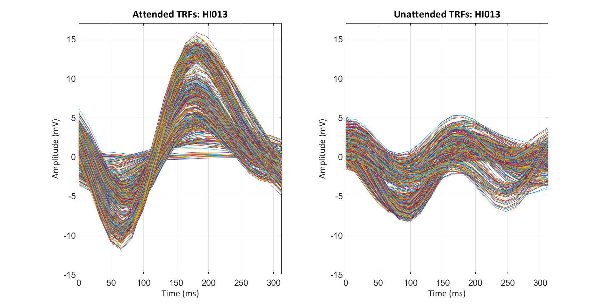
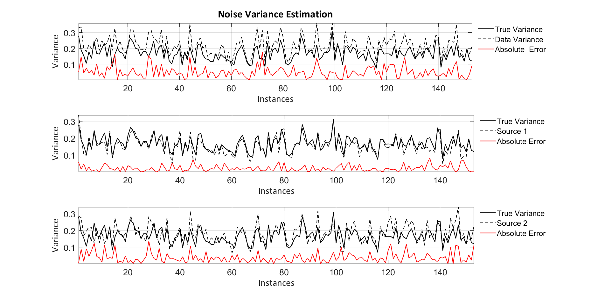

# Auditory Attention Estimation with EEG

MATLAB implementation of our paper 'Inference of the Selective Auditory Attention Using Sequential LMMSE Estimation', including temporal response function and noise coveriance estimation from a single channel EEG signal.

<p float="center">
  
  
</p>

# Usage 

For estimation, we stored our EEG data and corresponding envelope signals in the following tree. 

```
├── EEGData
│   ├── subject1.mat
│   └── subject2.mat
│   ...
├── speech
│   ├── subject1
│     ├── speechA_envelope.wav
│     └── speechB_envelope.wav
│     ...
│   └── subject2
│   ...
├── AADCode
```

AAD.m is the main script giving results and plots. Your EEG data (.mat files) or speech signals could be structured differently. To adapt correct file format, refer to getData.m file for loading, getAttention.m for selecting correct labels or selectElectrode.m for changing electrode selection protocol. LMMSE.m is the function returning estimated TRF functions.  

# Cite

If this code is useful for you, please cite:
```
@ARTICLE{9415171,
  author={Kuruvila, Ivine and Can Demir, Kubilay and Fischer, Eghart and Hoppe, Ulrich},
  journal={IEEE Transactions on Biomedical Engineering}, 
  title={Inference of the Selective Auditory Attention Using Sequential LMMSE Estimation}, 
  year={2021},
  volume={68},
  number={12},
  pages={3501-3512},
  doi={10.1109/TBME.2021.3075337}}

```
